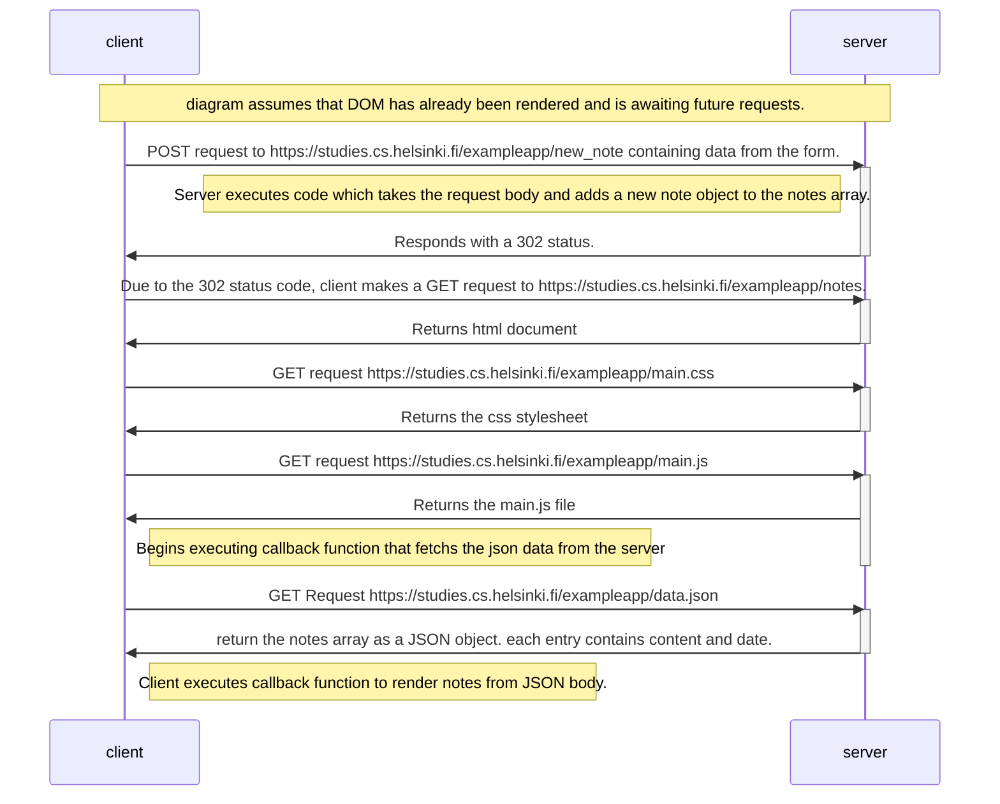

```mermaid
	sequenceDiagram
	participant client
	participant server
	
	Note over client, server: diagram assumes that DOM has already been rendered and is awaiting future requests.
    client->>server: POST request to https://studies.cs.helsinki.fi/exampleapp/new_note containing data from the form.

    activate server
    Note left of server: Server executes code which takes the request body and adds a new note object to the notes array.
    server->>client: Responds with a 302 status.
    deactivate server

    client->>server: Due to the 302 status code, client makes a GET request to https://studies.cs.helsinki.fi/exampleapp/notes.
    activate server
    server->>client: Returns html document
    deactivate server

    client->>server: GET request https://studies.cs.helsinki.fi/exampleapp/main.css
    activate server
    server->>client: Returns the css stylesheet
    deactivate server

    client->>server: GET request https://studies.cs.helsinki.fi/exampleapp/main.js
    activate server
    server->>client: Returns the main.js file
    Note right of client: Begins executing callback function that fetchs the json data from the server
    deactivate server

    client->>server: GET Request https://studies.cs.helsinki.fi/exampleapp/data.json
    activate server
    server->>client: return the notes array as a JSON object. each entry contains content and date.
    deactivate server

    Note right of client: Client executes callback function to render notes from JSON body.

```
