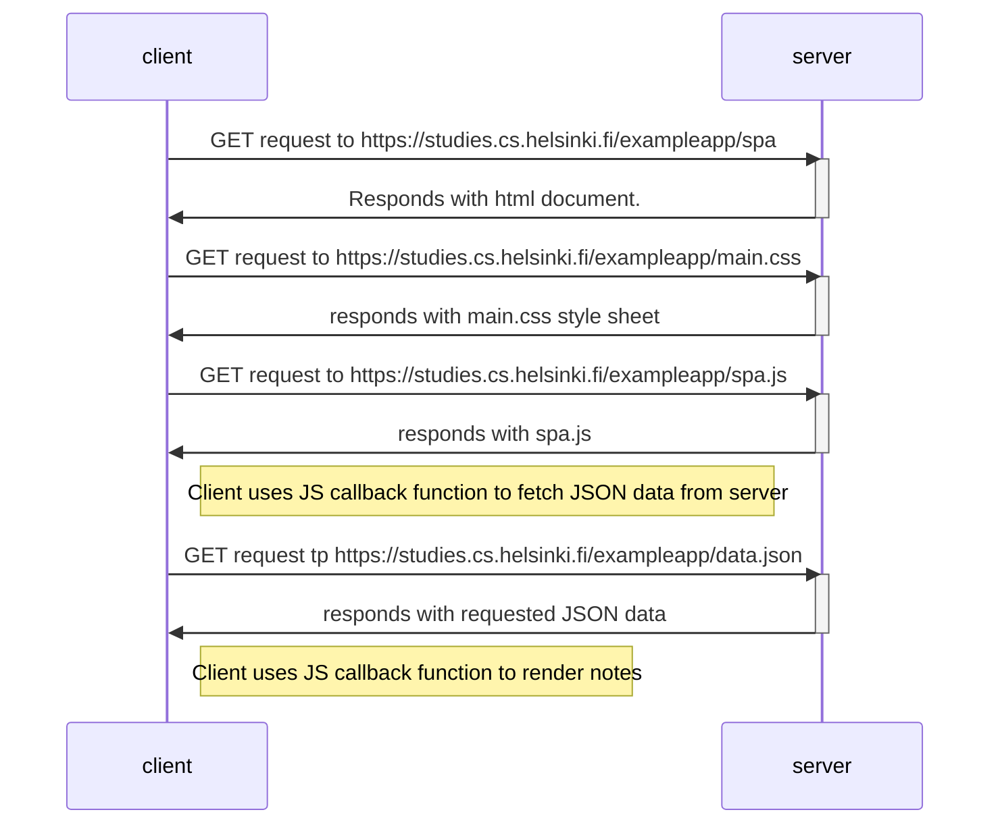

```mermaid
  sequenceDiagram
  participant client
  participant server

  client->>server: GET request to https://studies.cs.helsinki.fi/exampleapp/spa
  activate server
  server->>client: Responds with html document.
  deactivate server

  client->>server: GET request to https://studies.cs.helsinki.fi/exampleapp/main.css
  activate server
  server->>client: responds with main.css style sheet
  deactivate server

  client->>server: GET request to https://studies.cs.helsinki.fi/exampleapp/spa.js
  activate server
  server->>client: responds with spa.js
  deactivate server
  Note right of client: Client uses JS callback function to fetch JSON data from server

  client->>server: GET request tp https://studies.cs.helsinki.fi/exampleapp/data.json
  activate server
  server->>client: responds with requested JSON data
  deactivate server
  Note right of client: Client uses JS callback function to render notes
```
