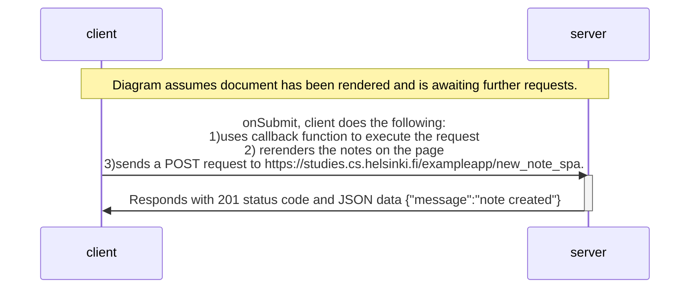

```mermaid
  sequenceDiagram
  participant client
  participant server

  Note over client, server: Diagram assumes document has been rendered and is awaiting further requests.
  client->>server: onSubmit, client does the following:<br/>1)uses callback function to execute the request<br/>2) rerenders the notes on the page <br/>3)sends a POST request to https://studies.cs.helsinki.fi/exampleapp/new_note_spa.
  activate server
  server->>client: Responds with 201 status code and JSON data {"message":"note created"}
  deactivate server
  
```
